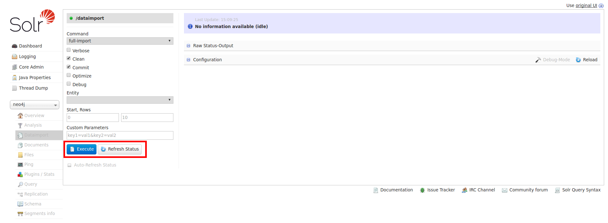

=== Apache SolR

==== Description

You can index your Neo4j database directly into SolR with the help of SolR `Data Import Handler` (DIH) feature and the neo4j jdbc driver.
This article is just on how to make the glue the two component via the JDBC driver.

If you want to learn how SolR works with its DIH feature, please refer to thoses documentations :
 * https://wiki.apache.org/solr/DataImportHandler
 * https://cwiki.apache.org/confluence/display/solr/Uploading+Structured+Data+Store+Data+with+the+Data+Import+Handler

==== How-to

Download the lastest release of SolR (for example : http://apache.crihan.fr/dist/lucene/solr/6.1.0/solr-6.1.0.tgz)

----
$>cd /tmp
$> wget http://apache.crihan.fr/dist/lucene/solr/6.1.0/solr-6.1.0.tgz
----

Extract it to a folder (reference as SOLR_HOME)

----
$> tar xzvf solr-6.1.0.tgz -C SOLR_HOME
----

Copy the folder `SOLR_HOME/example/example-DIH/solr/solr` to `SOLR_HOME/server/solr/neo4j`.
This will create a new SolR core called `neo4j` with all DIH feautres enabled.

----
$> cp -rf SOLR_HOME/example/example-DIH/solr/solr SOLR_HOME/server/solr/neo4j
----

Copy The Neo4j JDBC Driver jar into folder `SOLR_HOME/server/solr/neo4j/lib` (create the folder of it doesn't exist).

----
$> mkdir SOLR_HOME/server/solr/neo4j/lib
$> cp neo4j-jdbc-driver-3.0.1-SNAPSHOT.jar SOLR_HOME/solr/server/solr/neo4j/lib/
----

Edit the file `SOLR_HOME/server/solr/neo4j/config/solrconfig.xml` to add `lib` folder by adding this line :

----
<lib dir="./lib" />
----

We will configure SolR DIH feature by editing the file `SOLR_HOME/server/solr/neo4j/config/solr-data-config.xml`.
Just replace its content by this one (don't forget to replace the jdbc url, login password by yours):

----
<dataConfig>

	<dataSource type="JdbcDataSource"
				driver="org.neo4j.jdbc.Driver"
				url="jdbc:neo4j:bolt://localhost?noSsl"
				user="neo4j"
				password="test" />

	<document name="movie">
        <entity name="movie" query="MATCH (m:Movie) RETURN id(m) AS id, m.title AS title, m.tagline AS tagline, m.released AS released">
             <field name="id" column="id" />
	         <field name="title" column="title" />
             <field name="tagline_s" column="tagline" />
             <field name="release_i" column="released" />
        </entity>
	</document>

</dataConfig>
----

Start SolR server :

----
$> SOLR_HOME/bin/solr start
----

Open your browser at this url, http://localhost:8983/solr/#/neo4j/dataimport//dataimport , and click on the `Execute` button.
A click on the `refresh status` allow you to see the status of the indexation.

