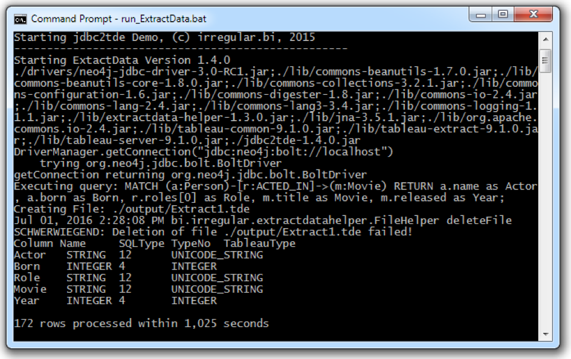
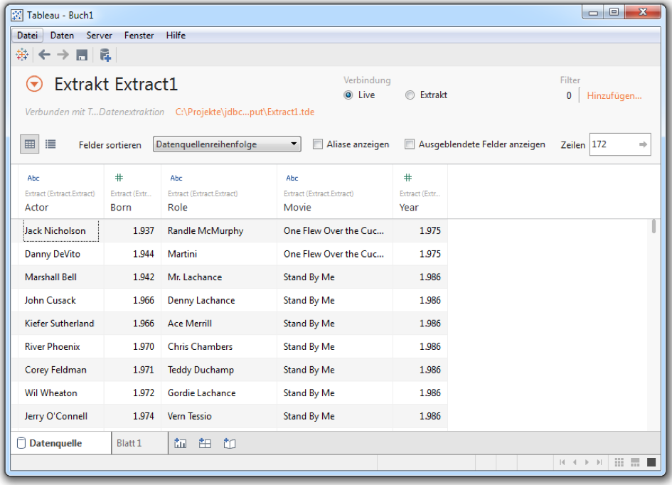
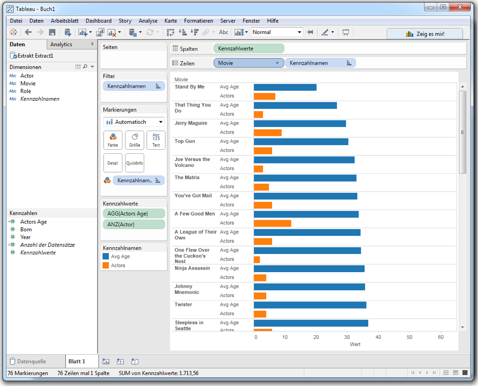
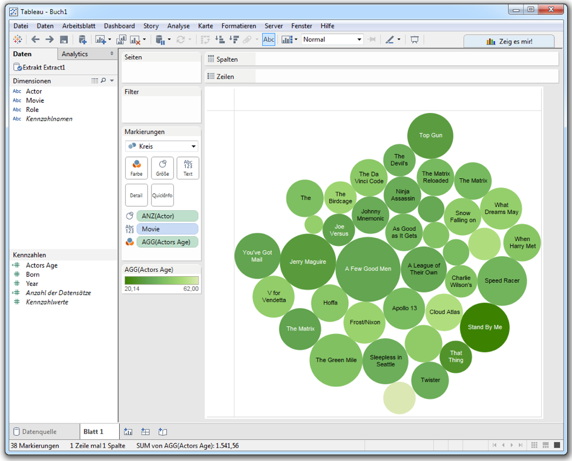
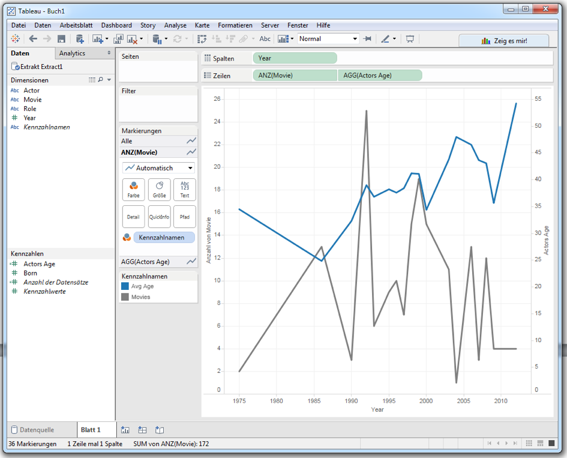

=== Tableau via jdbc2tde

(Thanks a lot to Ralf Becher, TIQ Solutions)

Integration with Tableau is not that trivial as it only generates SQL. 

So you can either use the Tableau REST integration (which we will publish soon). 

Or the jdbc2tde tool from TIQ that uses JDBC queries to generate TDE files.

Those can then be loaded into Tableau and visualized and interacted with in the many ways you know and love.

