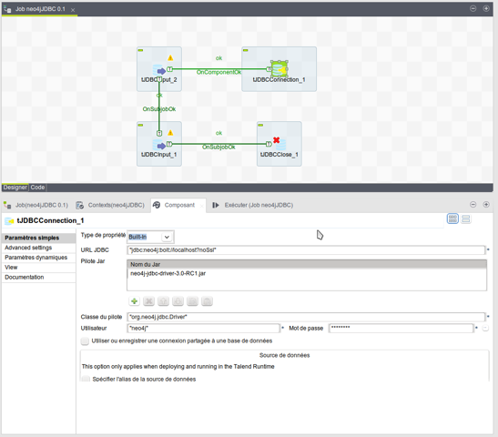
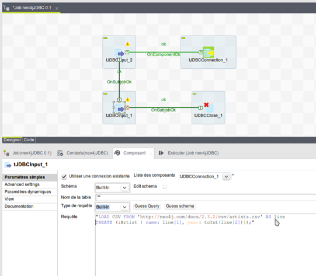

=== Talend

(Thanks a lot to Benoit Simard)

With Talend, you can query or import your data into Neo4j using Talend JDBC Components.
On the Job, you just have to add a tJDBCConnection and add the usual fields: JDBC-URL, Driver-Jar, Driver, username and password.

NB: On the Advanced Settings tab, you can also configure the auto-commit, if you want it.

Now, you can add some tJDBCInput to make some queries to your Neo4j databases like this :

